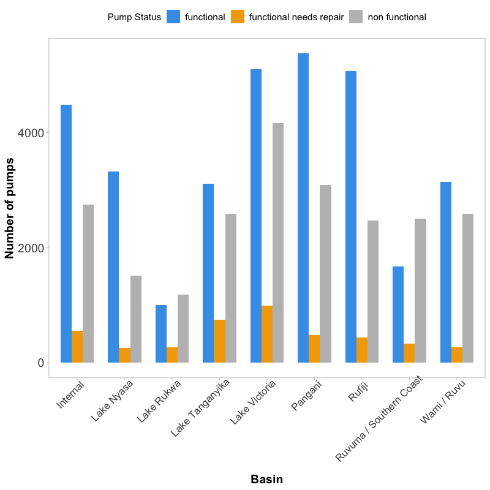
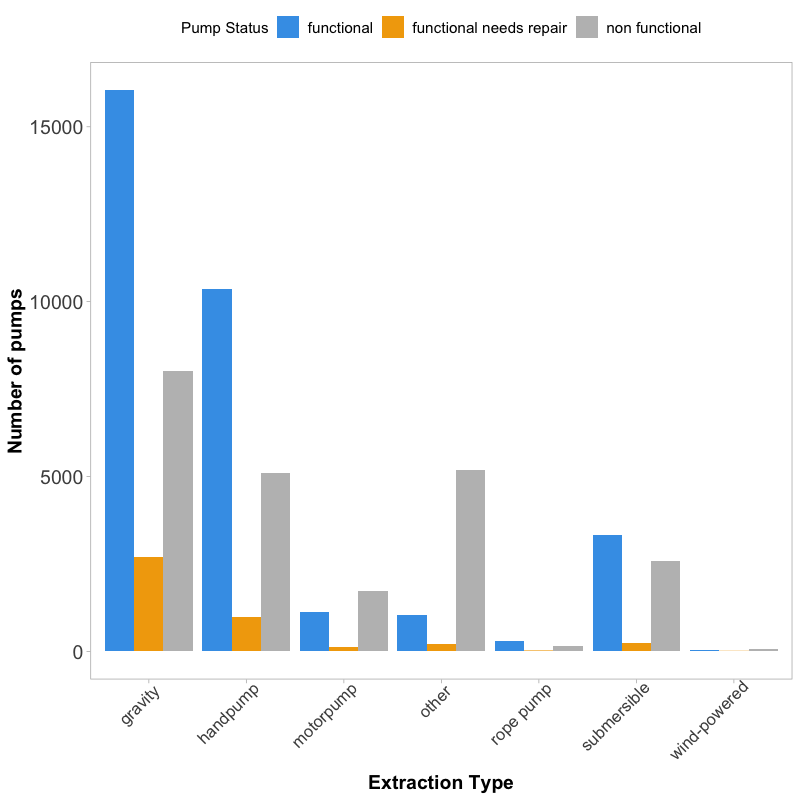
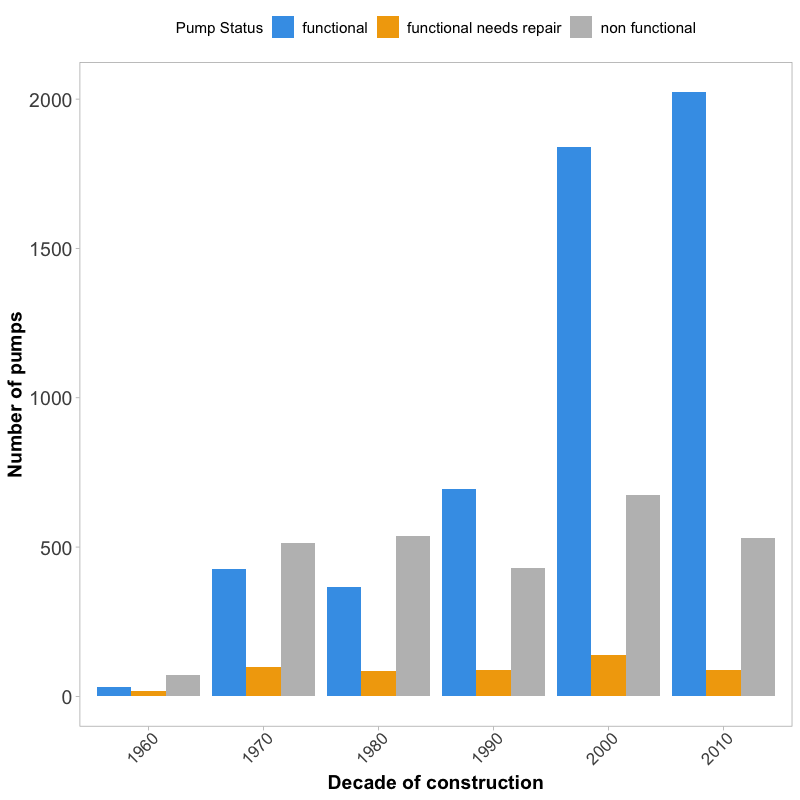
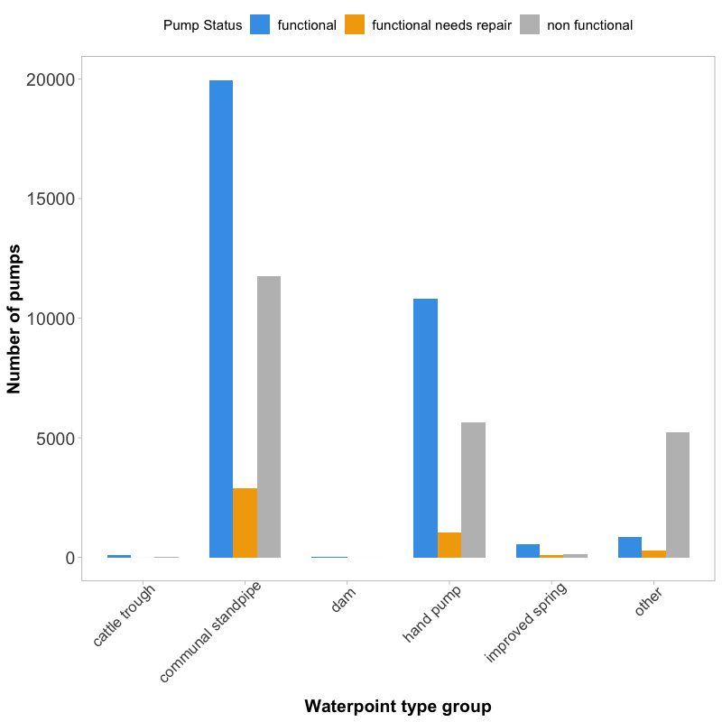
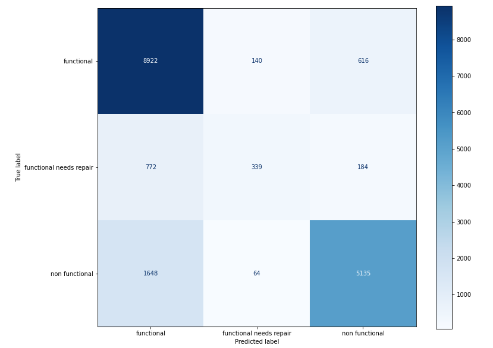
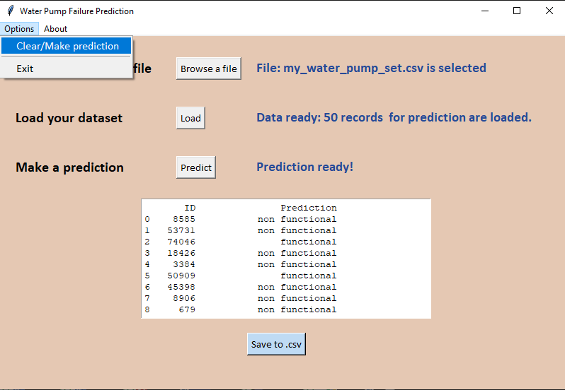
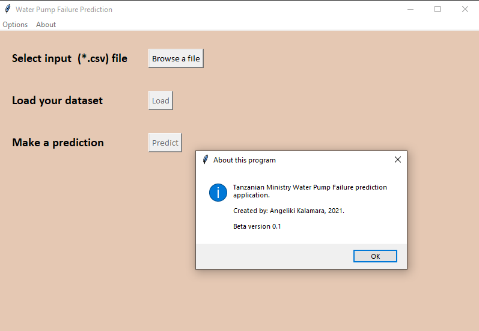

```{r setup, include=FALSE}
options(htmltools.dir.version = FALSE)
```

```{css echo=FALSE}
.darkblue {
  color: #1A5B8B;
}

.remark-slide-content > h1 {   font-size: 33px;   margin-top: -80px; }
```

```{r include=FALSE, message=FALSE}
library(dplyr)
library(highcharter)

df_wp_set=read.csv('water_pump_set.csv',header = T)
df_wp_labels=read.csv('water_pump_labels.csv',header=T)

df_merged = merge(df_wp_set,df_wp_labels,by='id')
```


# Problem statement

- Water is crucial to human existence and lif

- Water shortage in Tanzania (https://projectzawadi.org/water-shortage/)
    - caused by population growth
    - high level consumption
    - climate change (e.g. water shortage is a big problem in dry season)

Tanzanian Ministry of Water is interested in improving the maintenance of the Tanzanian water pumps. 

**The objective is to develop a reproducible model that can predict the failure of the pumps in the future.**

*Suggestion for deployment of the model acts as bonus!*

---
# Dataset

.pull-left[
- 59,400 rows (unique pumps)

- 41 column (features)

- **'status_group'** target variable
    - 'functional'
    - 'functional, needs repair'
    - 'non-functional'
- 31 categorical features (target variable included), 7 nnumerical and 2 date features.

- Imbalanced dataset!
]

.pull-right[
```{r echo=FALSE, message=FALSE, out.width = '2000px', out.height = '400px'}
df_status_pump = df_merged %>% group_by(status_group) %>% summarise(n=n()) %>% as.data.frame()
df_status_pump = df_status_pump %>% mutate(perc = paste0(round(n/nrow(df_merged) * 100,2),'%'))

library(ggplot2)
ggplot(df_status_pump, aes(x=status_group, y=n, fill = status_group)) +
    geom_bar(stat="identity", width=0.6)+
    geom_text(aes(label=paste0(n,' (',perc,')')), 
              position=position_dodge(width=0.2), hjust=0.5, vjust=-0.5, size=5) + 
    scale_fill_manual(values=c('#42A0E8','#F2A808', 'gray')) + ggtitle('Pump status')+
    labs(fill='Pump Status') +
    theme_minimal() + 
    expand_limits(y=c(0, 33000)) +
    theme(
        title=element_text(face='bold'),
        legend.position = 'top',
        legend.text = element_text(size=13),
        axis.title.x=element_blank(),
        axis.title.y=element_blank(),
        axis.text.y=element_blank(),
        axis.text.x=element_text(size=15,angle=45,hjust=0.9,vjust=0.9,face='bold'),
        panel.grid.major.x = element_blank(),
        panel.grid.minor.x = element_blank(),
        panel.grid.major.y = element_blank(),
        panel.grid.minor.y = element_blank()
    )
```
]

---

# Business Model

- Tanzanian Ministry of Water wants to decrease the overall cost of maintaining water pumps

- Predicting **functional but needs repair** class:

    - improves maintance operations of the water pumps
    - water pump is fixed in time
    - TMW does not spend money to fix functional pumps
    - ensure clean, potable water

---
# Data Preprocessing (1): Drop features

- Transform 'date_recorded' to mumeric (months passed untill 01/-1-2021) and drop it

- Drop 'recorded_by' (only 'GeoData Consultants Ltd') hence not very informative for the model

- Drop 'wpt_name' (waterpoint name) and 'num_private' as for the latter feature no explanation is provided in the data set legend and contains only numbers

---

# Data Preprocessing (2): Group features

Many categorical feature are very similar to each other; group them to reduce model complexity.

A. Extraction type ('extraction_type', 'extraction_type_group', **'extraction_type_class'**): latter is more coincise

B. Quantity (**'quantity'**, 'quantity_group'): exactly the same

C. Payment ('payment', **'payment_type'**): exactly the same

D. Waterpoint type ('waterpoint_type', **'waterpoint_type_group'**): better/less redundant categorization (communal standpipe + communal standpipe multiple together in one category)

E. Management (**'management'**, 'management_group'): latter appears very generic; first provides a little more info; management of the waterpoint is critical as it can directly contribute to failure.

F. Source (**'source'**, 'source_type', 'source_class'): could be important feature for predicting pump failure; 'source' was kept as sufficiently descriptive.


<i><span class="darkblue">The features in <b>bold</b> are the ones kept to be used to build the predictive model.</span></i>

---

#  Data Preprocessing (3): Handle 0's

Handle O's in the dataset:

- Construction year; replace 0 values with median construction year
- Population - has lots of zeros (aka NAs); replace with median polulation

---

# Data Preprocessing (4): Handle NULL/NA values

```{r echo=FALSE}
xx = sapply(colnames(df_merged), function(x) {
    which(df_merged[,x] == '') %>% length
})

xx = xx[xx!=0] %>% sort
df_null = data.frame(feature = names(xx), num_null = as.numeric(xx))

knitr::kable(df_null, format = 'html')
```

**Drop these features**

---

# Spread of water pumps in Tanzania

```{r echo=FALSE, message=FALSE}
library(viridisLite)
library(highcharter)
library(dplyr)
df_pump_per_region = df_merged %>% group_by(region) %>% summarise(total=n()) %>% as.data.frame()

mapdata <- download_map_data("https://code.highcharts.com/mapdata/countries/tz/tz-all.js")

highchart() %>%
    hc_add_series_map(mapdata, df_pump_per_region, name = "Water Pumps",
                      value = "total", joinBy = c("woe-name", "region"),
                      dataLabels = list(enabled = TRUE, format = '{point.properties.name}')) %>%
    hc_mapNavigation(enabled = TRUE) %>%
    hc_add_series(
        data = dd_basins, 
        type = "mappoint",
        name = "Basins", 
        color = "red"
    ) 
```

---

# Pump status functionality across Tanzania

```{r echo=FALSE, message=FALSE}
unfactor <- function(df){
    #unfactor a data frame object
    i <- sapply(df, is.factor)
    df[i] <- lapply(df[i], as.character)
    df
}

df_status_pump_per_region = df_merged %>% group_by(region, status_group) %>% summarise(n=n()) %>% as.data.frame() %>% unfactor()

df_status_pump_per_region_class = df_status_pump_per_region %>% group_by(region) %>% top_n(1, n) %>% as.data.frame()
df_status_pump_per_region_class = df_status_pump_per_region_class[,1:2]

series <- df_status_pump_per_region_class %>% 
  group_by(name = status_group) %>% 
  do(data = list_parse(select(., region))) %>%
  ungroup() %>% 
  mutate(color = c("green", "gray"))

highchart(type = "map") %>% 
  hc_plotOptions(map = list(
    allAreas = FALSE,
    joinBy = c("woe-name", "region"),
    dataLabels = list(enabled = TRUE, format = '{point.properties.name}'),
    mapData = mapdata
  )) %>% 
  hc_add_series_list(series)
```

---

# Baseline model

Multi-class problem

.center[
```{r echo=FALSE, message=FALSE, out.width = '500px', out.height = '460px'}
df_status_pump = df_merged %>% group_by(status_group) %>% summarise(n=n()) %>% as.data.frame()
df_status_pump = df_status_pump %>% mutate(perc = paste0(round(n/nrow(df_merged) * 100,2),'%'))

library(ggplot2)
ggplot(df_status_pump, aes(x=status_group, y=n, fill = status_group)) +
    geom_bar(stat="identity", width=0.6)+
    geom_text(aes(label=paste0(n,' (',perc,')')), 
              position=position_dodge(width=0.2), hjust=0.5, vjust=-0.5, size=5) + 
    scale_fill_manual(values=c('#42A0E8','#F2A808', 'gray')) + ggtitle('Pump status')+
    labs(fill='Pump Status') +
    theme_minimal() + 
    expand_limits(y=c(0, 33000)) +
    theme(
        title=element_text(face='bold'),
        legend.position = 'top',
        legend.text = element_text(size=13),
        axis.title.x=element_blank(),
        axis.title.y=element_blank(),
        axis.text.y=element_blank(),
        axis.text.x=element_text(size=15,angle=45,hjust=0.9,vjust=0.9,face='bold'),
        panel.grid.major.x = element_blank(),
        panel.grid.minor.x = element_blank(),
        panel.grid.major.y = element_blank(),
        panel.grid.minor.y = element_blank()
    )
```
]

--

Baseline model: 0.543 * 0.543 + 0.384 * 0.384 + 0.073 * 0.072 = 0.4473 (44.73% accuracy).

---

# Predictive model

- Final dataset: 10 numerical and 10 categorical

- One-Hot encoding will be used for the categorical data transformation

.pull-left[
Numerical:
    - amount_tsh
    - gps_height
    - longitude
    - latitude
    - region code
    - population
    - construction year
    - recorded date
    - decade
]

.pull-right[
Categorical:
    - basin
    - region
    - lga
    - extraction type group
    - management
    - payment type
    - extraction type class
    - water quality
    - quality group
    - quantity
    - source
    - waterpoint type group
]

---

# Random Forest

- Random Forest will be deployed (ensemble of trees)

--

    - suitable for large datasets (still can be complex; proper data preprocessing)
--

    - no special feature selection (but use with care!)
    
--

    - robust to overfitting
    
--

    - works well with non-linear data
    
--

    - suitable for multi-classification problems
    
--

---

# Build model & accuracy

- Random Forest OOB score: 79.7% and 80.4% (optimized)

--

- Stratified split of the data into train and test sets. (70% training and 30% testing)

.center[
```{r echo=FALSE, fig.height = 6, fig.width = 10}
models = c('Baseline','Random Forest', 'Decision Tree', 'Random Forest opt.')
acc = c(44.73,80.55, 75.32, 80.78)
time = c(NA,10.8, 1.54, 241.8)
df = data.frame(Models = models, accuracies = acc)

ggplot(df, aes(x=models, y=accuracies, fill=models)) +
    geom_bar(stat="identity", width=0.5)+
    geom_text(aes(label=paste0(accuracies,'%',' (',time,' secs)')), 
              position=position_dodge(width=0.2), hjust=0.5, vjust=-0.5, size=5) + 
    scale_fill_manual(values=c('gray','#F2A808', 'lightblue', 'magenta4')) +
    labs(fill='Models') +
    theme_minimal() + 
    theme(
        title=element_text(face='bold'),
        legend.position = 'top',
        legend.text = element_text(size=13),
        axis.title.x=element_blank(),
        axis.title.y=element_blank(),
        axis.text.y=element_blank(),
        axis.text.x=element_text(size=15,angle=30,hjust=0.9,vjust=1,face='bold'),
        panel.grid.major.x = element_blank(),
        panel.grid.minor.x = element_blank(),
        panel.grid.major.y = element_blank(),
        panel.grid.minor.y = element_blank()
    )
```
]

---

# Important features

- quantity water (dry)

- location (longitude/latitude)

- date recorded

- waterpoint type group ('other' scored higher)

- gps_height (altitude of the well) [**Absolute Water Pumps, 2019**](https://www.absolutewaterpumps.com/blog/how-altitude-affects-water-pump).

- construction year

- population

- amount_tsh (amount of water avalable to the waterpoint)

- extraction type class ('other')

---

# Region and Contruction type

.pull-left[
```{r echo=FALSE}

```
]

.pull-right[
```{r echo=FALSE}

```
]

---

# Construction Year & Caterpoint type

.pull-left[
```{r echo=FALSE}

```
]

.pull-right[
```{r echo=FALSE}

```
]
---

# Confusion Matrix

```{r echo=FALSE}

```

---

# Conclusion

- Accuracy ~81% (36% increse from baseline model), weighted-F1 score 0.8

--

- Reasonable most important features e.g. with the water quantity features, the location, construction year and waterpoint type group.

--

- Powerful enough model ,without evidence of overfitting, that provides confidence for future predictions.

--

- Model deployed via in a user-friendly application

---

# Future Steps

- Despite stratification in train/test splitting, imbalanced classes is a real-world issue

- How to tackle this?

    - Consult with the client :)
        - more data
        - merge classes 
        
    - Over-sample or under-sample (e.g SMOTE technique can improve OOB score in Random Forest from 79.7% to 86.4%)

- Identify the life time of a pump (e.g. from manufacturer?) -> help TMW to repair them in time (before becoming non-functional).

- No correlation between number of pumps and area population (r = -0.08); suggest to the TMW to tackle this

---

class: middle

## ***Bonus!***

---

# Model deployment (1)

```{r echo=FALSE}
knitr::include_graphics("index_files/figure-html/app_01.png")
```

---

# Model deployment (2)

```{r echo=FALSE}
knitr::include_graphics("index_files/figure-html/app_02.png")
```

---

# Model deployment (3)

```{r echo=FALSE}
knitr::include_graphics("index_files/figure-html/app_03.png")
```

---

# Model deployment (4)

```{r echo=FALSE}
knitr::include_graphics("index_files/figure-html/app_04.png")
```

---

# Model deployment (5)

```{r echo=FALSE}
knitr::include_graphics("index_files/figure-html/app_05.png")
```

---

# Model deployment (6)

```{r echo=FALSE}

```

---

# Model deployment (7)

```{r echo=FALSE}

```

---

class: middle

## Thank you!
